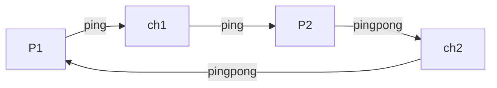
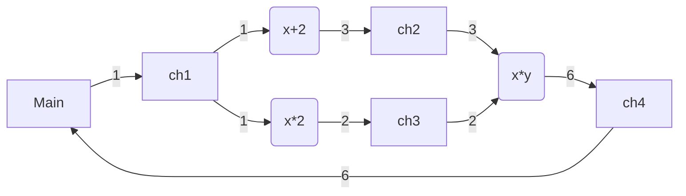

# CSPLib

[](https://crates.io/crates/csplib)
[](https://docs.rs/csplib)

Communicating Sequential Processes (CSP) is a way of writing a concurrent application using message passing through channels. It is practically used in Go's channel for communication between threads. 


In the textbook CSP as in the figure above, the writer should block until reader consumes the passing value so as to hold only one value in the channel, which is I guess a good property for mathematical analysis. However, any reader doesn't exist when writer puts a value in the channel isn't practiacally a case. Also, allowing only one reader limits the use case. 

So alternatively in this library, writer is never blocked by the reader and allows multiple readers (SPMC) based on the assumption reader is ready when the writer starts putting a value on the channel.

## Examples

### Example 1



is equivalent to

```rust
let (w1, ch1) = channel();
let (w2, ch2) = channel();
tokio::spawn({
    let r1 = ch1.reader();
    async move {
        let x = r1.get().await.unwrap();
        tokio::task::yield_now().await;
        let s = format!("{}pong", x);
        w2.put(s).unwrap();
    }
});
let y = tokio::spawn({
    let r2 = ch2.reader();
    async move {
        let x = "ping".to_owned();
        w1.put(x).unwrap();
        tokio::task::yield_now().await;
        let y = r2.get().await.unwrap();
        y
    }
})
.await
.unwrap();
assert_eq!(y, "pingpong")
```

----

### Example 2



is equivalent to

```rust
let (w1, ch1) = channel();
let (w2, ch2) = channel();
let (w3, ch3) = channel();
let (w4, ch4) = channel();
// λx. x+2
tokio::spawn({
    let r1 = ch1.reader();
    async move {
        let x = r1.get().await.unwrap();
        w2.put(x + 2).unwrap();
    }
});
// λx. x*2
tokio::spawn({
    let r1 = ch1.reader();
    async move {
        // Emulating expensive I/O
        tokio::time::sleep(std::time::Duration::from_secs(5)).await;
        let x = r1.get().await.unwrap();
        w3.put(x * 2).unwrap();
    }
});
// λxy. x*y
tokio::spawn({
    let r2 = ch2.reader();
    let r3 = ch3.reader();
    async move {
        let (x, y) = tokio::try_join!(r2.get(), r3.get()).unwrap();
        w4.put(x * y).unwrap();
    }
});
w1.put(1).unwrap();
let r4 = ch4.reader();
let ans = r4.get().await.unwrap();
assert_eq!(ans, 6);
```
