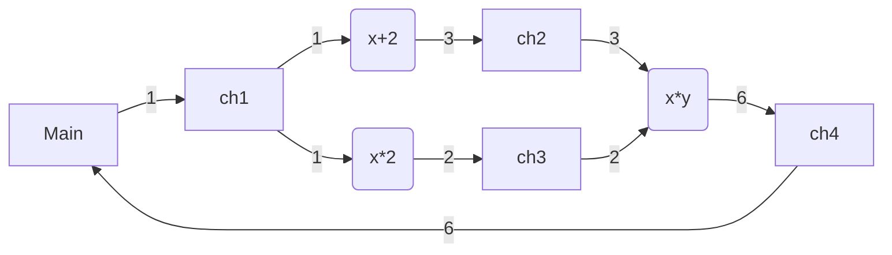

# CSPLib

[](https://crates.io/crates/csplib)
[](https://docs.rs/csplib)

## Communicating Sequential Processes (CSP)

### Background

Communicating Sequential Processes (CSP) is a way of writing a concurrent application using message passing through channels. It is practically used in Go's channel for communication between threads. 


### Computational Graph

The building block of the deep learning is computational graph and it can be implemented as CSP.


### Logical Circuit

Logical circuit can be implemented as CSP as well.


## Library Design

In the textbook CSP, the writer should block until reader consumes the passing value so as to hold only one value in the channel, which I guess is a good property for mathematical analysis. However, any reader doesn't exist when writer puts a value in the channel isn't practiacally a case. Also, allowing only one reader limits the use case. 

So alternatively in this library, writer is never blocked by the reader and allows multiple readers (SPMC) based on the assumption reader is ready when the writer  a value on the channel. If any reader doesn't exist, the writer fails.

## Example



is equivalent to

```rust
#[csplib::process]
struct P1 {
    #[input]
    a: i32,
    #[output]
    b: i32,
}
// λx. x+2
async fn run_p1(inner: P1Inner) -> Result<()> {
    let x = inner.a_r.reader().get().await?;
    inner.b_w.put(x + 2)?;
    Ok(())
}
#[csplib::process]
struct P2 {
    #[input]
    a: i32,
    #[output]
    b: i32,
}
// λx. x*2
async fn run_p2(inner: P2Inner) -> Result<()> {
    let x = inner.a_r.reader().get().await?;
    // Emulating expensive I/O
    tokio::time::sleep(std::time::Duration::from_secs(5)).await;
    inner.b_w.put(x * 2)?;
    Ok(())
}
#[csplib::process]
struct P3 {
    #[input]
    a: i32,
    #[input]
    b: i32,
    #[output]
    c: i32,
}
// λxy. x*y
async fn run_p3(inner: P3Inner) -> Result<()> {
    let x = inner.a_r.reader().get().await?;
    let y = inner.b_r.reader().get().await?;
    inner.c_w.put(x * y)?;
    Ok(())
}

let (main_w, main_r) = channel();
let (p1, p1_inner) = P1::new();
let (p2, p2_inner) = P2::new();
let (p3, p3_inner) = P3::new();

tokio::spawn(run_p1(p1_inner));
tokio::spawn(run_p2(p2_inner));
tokio::spawn(run_p3(p3_inner));

tokio::spawn(connect(main_r.reader(), p1.a_w));
tokio::spawn(connect(main_r.reader(), p2.a_w));
tokio::spawn(connect(p1.b_r.reader(), p3.a_w));
tokio::spawn(connect(p2.b_r.reader(), p3.b_w));

// Wait for all spawnings.
tokio::time::sleep(std::time::Duration::from_secs(1)).await;

main_w.put(1).unwrap();
let ans = p3.c_r.reader().get().await.unwrap();
assert_eq!(ans, 6);
```
