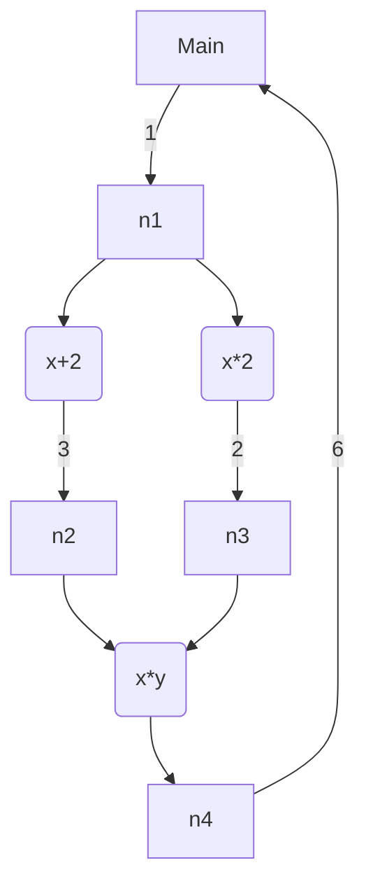

# Circuit

Implement concurrent application like circuit.



is equivalent to

```rust
let n1 = Node::new();
let n2 = Node::new();
let n3 = Node::new();
let n4 = Node::new();
// λx. x+2
tokio::spawn({
    let out1 = n1.output();
    let in2 = n2.input();
    async move {
        let x = out1.get().await.unwrap();
        in2.put(x + 2).unwrap();
    }
});
// λx. x*2
tokio::spawn({
    let out1 = n1.output();
    let in3 = n3.input();
    async move {
        let x = out1.get().await.unwrap();
        in3.put(x * 2).unwrap();
    }
});
// λxy. x*y
tokio::spawn({
    let out2 = n2.output();
    let out3 = n3.output();
    let in4 = n4.input();
    async move {
        let (x, y) = tokio::try_join!(out2.get(), out3.get()).unwrap();
        in4.put(x * y).unwrap();
    }
});
let in1 = n1.input();
in1.put(1).unwrap();
let out4 = n4.output();
let ans = out4.get().await.unwrap();
assert_eq!(ans, 6);
```
