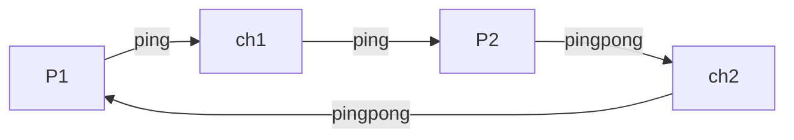
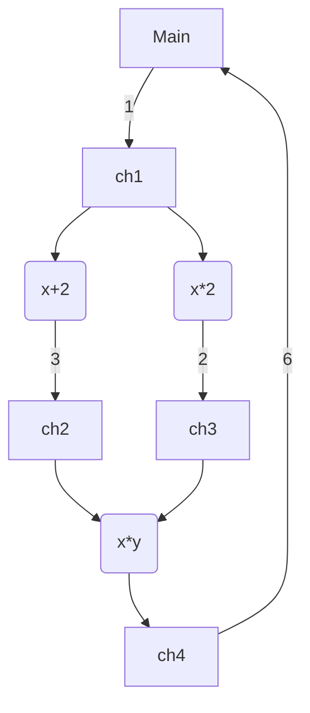

# Circuit

Implement concurrent application like circuit.

## Examples

### Example 1



is equivalent to

```rust
let ch1 = Channel::new();
let ch2 = Channel::new();
tokio::spawn({
    let r1 = ch1.reader();
    let w2 = ch2.writer();
    async move {
        let x = r1.get().await.unwrap();
        tokio::task::yield_now().await;
        let s = format!("{}pong", x);
        w2.put(s).unwrap();
    }
});
let y = tokio::spawn({
    let w1 = ch1.writer();
    let r2 = ch2.reader();
    async move {
        let x = "ping".to_owned();
        w1.put(x).unwrap();
        tokio::task::yield_now().await;
        let y = r2.get().await.unwrap();
        y
    }
})
.await
.unwrap();
assert_eq!(y, "pingpong")
```

----

### Example 2



is equivalent to

```rust
let ch1 = Channel::new();
let ch2 = Channel::new();
let ch3 = Channel::new();
let ch4 = Channel::new();
// λx. x+2
tokio::spawn({
    let r1 = ch1.reader();
    let w2 = ch2.writer();
    async move {
        let x = r1.get().await.unwrap();
        w2.put(x + 2).unwrap();
    }
});
// λx. x*2
tokio::spawn({
    let r1 = ch1.reader();
    let w3 = ch3.writer();
    async move {
        // Emulating expensive I/O
        tokio::time::sleep(std::time::Duration::from_secs(5)).await;
        let x = r1.get().await.unwrap();
        w3.put(x * 2).unwrap();
    }
});
// λxy. x*y
tokio::spawn({
    let r2 = ch2.reader();
    let r3 = ch3.reader();
    let w4 = ch4.writer();
    async move {
        let (x, y) = tokio::try_join!(r2.get(), r3.get()).unwrap();
        w4.put(x * y).unwrap();
    }
});
let w1 = ch1.writer();
w1.put(1).unwrap();
let r4 = ch4.reader();
let ans = r4.get().await.unwrap();
assert_eq!(ans, 6);
```
